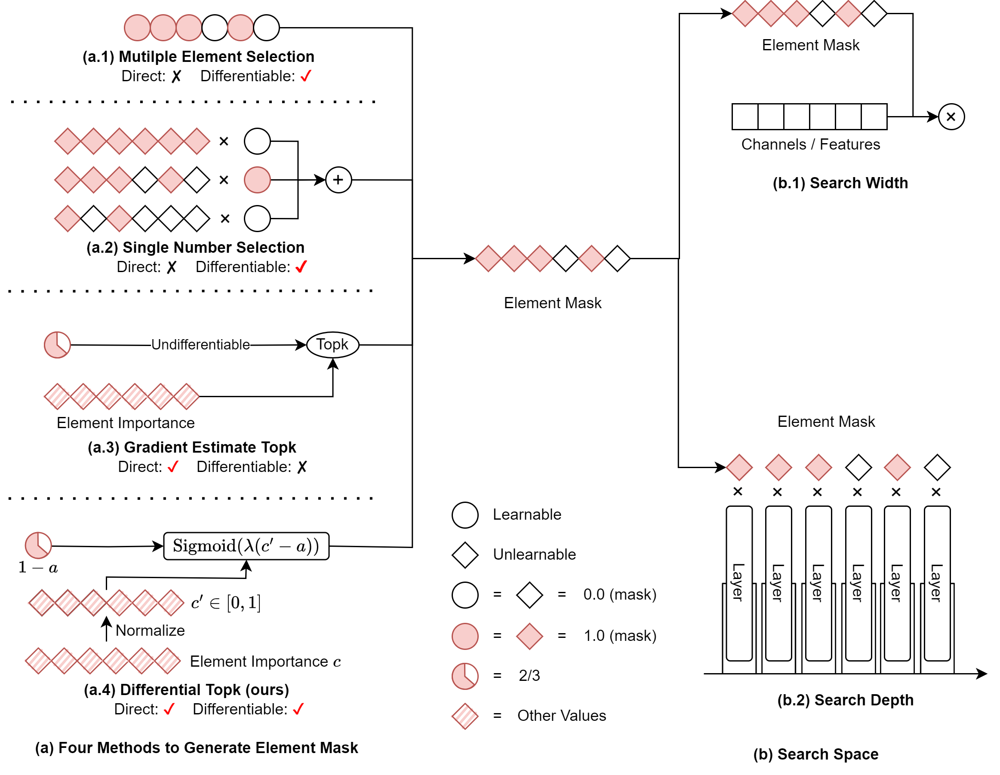

# Differentiable Model Scaling using Differentiable Topk

This repo is the official implementation of "[Differentiable Model Scaling using Differentiable Topk](https://arxiv.org/abs/2405.07194)".

## Introduction



In this project, we propose a differentiable topk operator. It searches for **k** in a fully smooth and differentiable way. We use this operator to scale the model width and depth. We show that our method is more efficient and effective than the existing methods.

# Getting Started

We provide the code for our differentiable topk operator and the experiments in the paper.
We place the core code of the differentiable topk operator in the `dms` folder. The experiments are in the `applications` folder.

There are two steps to run our experiments:

1. run ```pip install -e .``` to install differentiable topk operator.
2. cd to the `applications` folder and run the experiments you want.

# Main Results

# Cite