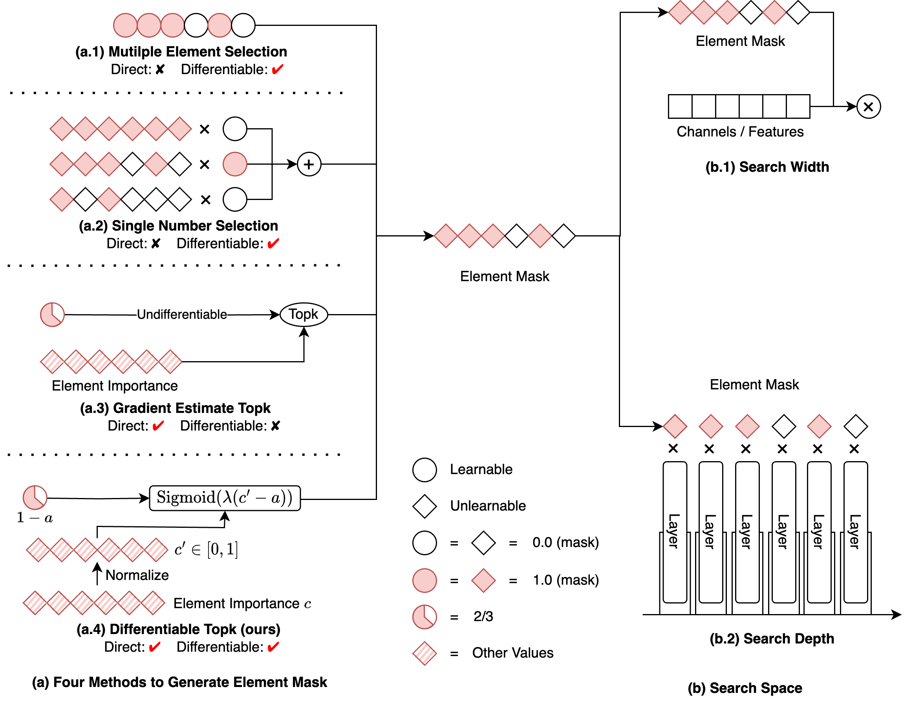

# Differentiable Model Scaling using Differentiable Topk

This repo is the official implementation of "[Differentiable Model Scaling using Differentiable Topk](https://arxiv.org/abs/2405.07194)".

## Introduction



In this project, we propose a differentiable topk operator. It searches for **k** in a fully smooth and differentiable way. We use this operator to scale the model width and depth. We show that our method is more efficient and effective than the existing methods.

# Getting Started

We provide the code for our differentiable topk operator and the experiments in the paper.
We place the core code of the differentiable topk operator in the `dms` folder. The experiments are in the `applications` folder. Besides, our code is based on [mmrazor](https://github.com/open-mmlab/mmrazor), a powerful model compression toolbox. We provide a modified version of mmrazor in the `mmrazor` folder.

There are several steps to prepare the environment and run the codes.

1. run ```pip install -e .``` to install differentiable topk operator and related modules.
2. run ```cd mmrazor && pip install -e .``` to install the modified version of mmrazor.
3. cd to the `applications` folder and find the experiment you want to run. Moreover, you also should follow the instructions in each experiment folder.
